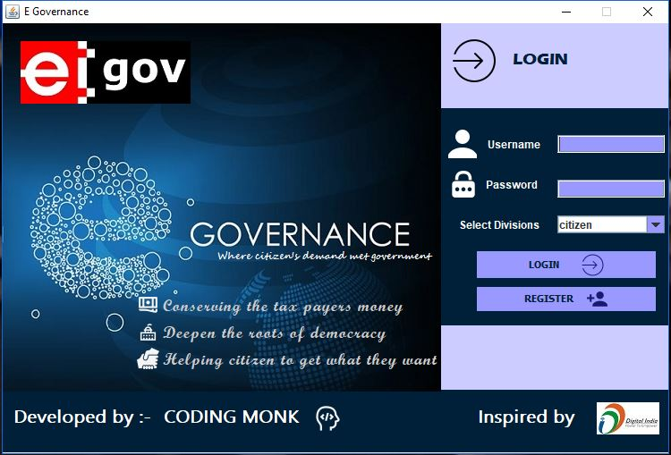
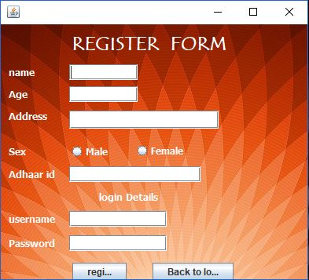
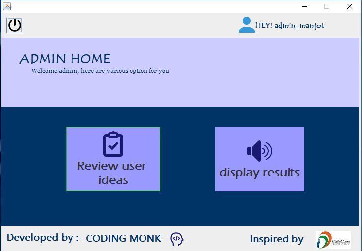
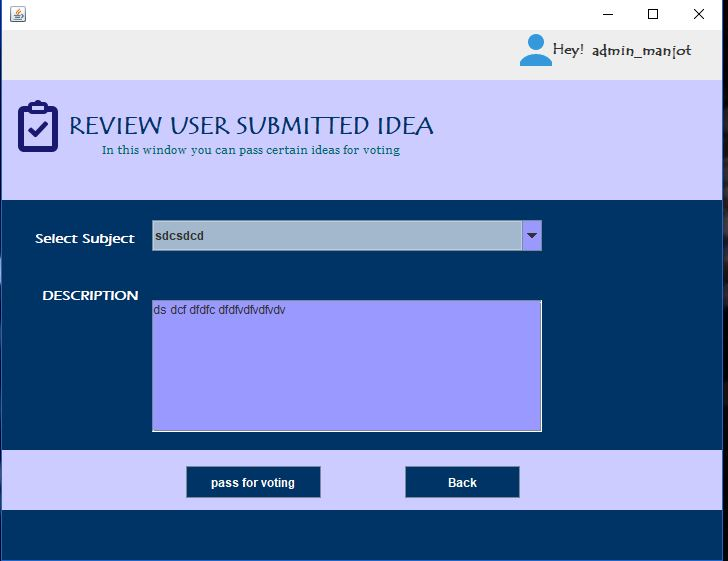
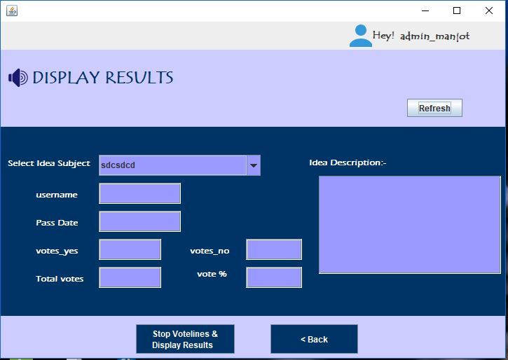

# e_governance
To enable complete working of this app please restore database file that is in database directory named as egovernance.sql
after that change appropriate settings for your mySQL database i.e  name and password and url  in class mySQlconnect java class.java

  <h2>Landing screen</h2>
  
  <h2>Register screen</h2>
  
  <h2>Admin Home</h2>
  
 

    
    

  

  

